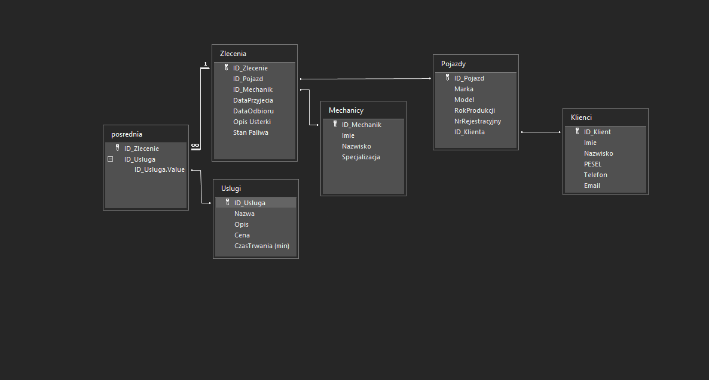

# Sprawozdanie – Baza danych warsztatu samochodowego

## 1. Opis oraz zastosowanie bazy danych

Stworzona baza danych służy do zarządzania warsztatem samochodowym. Umożliwia rejestrowanie klientów, pojazdów, zleceń naprawczych, usług oraz mechaników. Baza pozwala prowadzić ewidencję wykonanych usług oraz monitorowanie ilości zleceń i klientów.

**Zastosowanie:**
- Rejestracja klientów i ich pojazdów
- Tworzenie zleceń naprawczych
- Ewidencja wykonanych usług
- Ułatwienie pracy mechaników i kierowników warsztatu

## 2. Diagram ERD

## 3. Opis poszczególnych kwerend

### Ile napraw w miesiącu
Pokazuje najbardziej problematyczne pojazdy w zestawieniu miesięcznym
### Ile zleceń na mechanika
Pokazuje sumę zleceń przypadającą na jednego mechanika w serwisie malejąco
### Klient z największą flotą
Pokazuje posortowane od największej liczby, sumy pojazdów zarejestrowanych na jednego klienta. Pozwala to znaleźć najbardziej lojalnych klientów i do nich kierować propozycje zaciśnienia współpracy

## 4. Opis formularzy

Formularze w bazie danych umożliwiają wygodne zarządzanie informacjami:
- Formularz do dodawania klientów
- Formularz do wprowadzania pojazdów
- Formularz tworzenia zleceń i usług
- Formularz do wprowadzania mechaników
- Formularz do dołączania usług do zleceń (są one osobno)

## 5. Podział pracy

| Osoba             | Zakres wykonanej pracy                                |
|-------------------|--------------------------------------------------------|
| Kacper Mucha      | Projekt bazy danych, relacje              |
| Mateusz Walczak        | Formularze, dokumentacja                           |
| Kacper Janusz  | Kwerendy, diagram ERD                 |